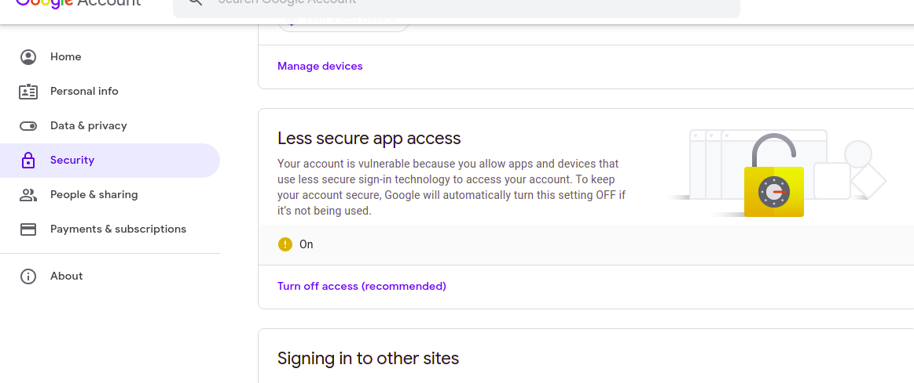

## PHP MAILER.
PHPMailer is a code library to send emails safely and easily via PHP code from a web server. Sending emails directly by PHP code requires a high-level familiarity to SMTP protocol standards and related issues and vulnerabilities about Email injection for spamming.
### to use this you must disable less secure app access on the sender google account.
;